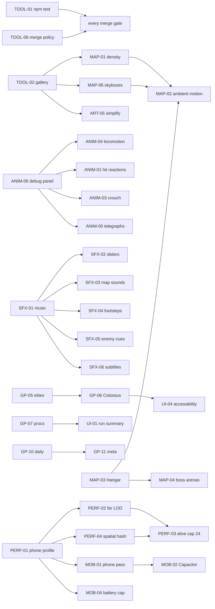

# Ferrous Arena — Execution Plan

How to get from **v2.8.0** to **v1.0 (ship)** by draining `MASTER-ROADMAP.md`.
`MASTER-ROADMAP.md` is *what* to build. This file is *in what order, in which lane, and with what gate*.

**Budget:** 55 tasks ≈ **74 sessions**, run **3 at a time** across 3 lanes ≈ **24 rounds**.
At 3 sessions/day that is ~5 working weeks; at 1/day, ~15 weeks. The critical path is Lane A (the `32-loop.js` owner) at ~25 sessions — nothing shortens the project below that without splitting the loop file.

---

## 0. What changes about the protocol

The roadmap's session protocol is sound but has three gaps that will bite once three branches are live at once. Fix them in round 1.

### 0.1 Three locks, not one

The roadmap names one hot file. There are three, plus two soft ones.

| Lock | File(s) | Rule |
|---|---|---|
| **LOOP** | `src/32-loop.js` | One live branch at a time. **Lane A owns it** — no other lane opens a task that touches it. |
| **PACK** | `tools/pack-quaternius.js` → `src/06-assets.js` | One live branch at a time, any lane. Claim it, repack **on `main`**, never merge `06-assets.js`. |
| **SCREENS** | `src/35-screens.js` | One live branch at a time. **Lane C owns it** by default; Lane B borrows it for MAP-05 only (round 19). |
| soft | `src/19b-maps.js` | Two lanes may share it **only on different map builders**. The round table below is already deconflicted by map. |
| soft | `src/styles.css` | Additive-only edits; append new rules rather than reflowing existing blocks. |

### 0.2 Stop committing generated artifacts on branches

`arena.body.html`, `ferrous-arena.html`, `test-local.html` and `docs/` total ~28 MB of generated output, and `src/06-assets.js` is another 6.9 MB. Every branch regenerates all of them, so **every merge will conflict on ~35 MB of machine-written text**. Three parallel lanes make this the single largest source of lost work in the whole plan.

New task, paste this into `MASTER-ROADMAP.md` under TOOL:

> | **TOOL-06** `[ ]` | **Generated-artifact merge policy.** `.gitattributes` marks `arena.body.html`, `ferrous-arena.html`, `test-local.html`, `docs/**` and `src/06-assets.js` as `-diff merge=ours`; branches commit **`src/` only**; `npm run release` on `main` runs `build.js` + the suites + commits the generated set in one commit. Document the rule in `HANDOFF.md §3`. | S | `.gitattributes`, `package.json`, `build.js`, `HANDOFF.md` | Two branches that both touched `src/` merge to `main` with zero conflicts in generated files; `npm run release` reproduces the bundle byte-for-byte from `src/`. |

### 0.3 The merge gate is six manual commands

Step 4 of the protocol ("`node build.js` then all suites … print `ERRORS: none`") runs **55 times** over this plan, six commands each. `TOOL-01` collapses it to `npm test`. It goes first, ahead of everything, because every subsequent task pays the tax until it lands.

---

## 1. Lanes

Lanes are defined by which files they may touch, so two live branches never collide.

| Lane | Owns | Never touches | Sessions |
|---|---|---|---|
| **A — Loop** | `32-loop.js`, `20-player.js`, `21b-nav.js`, animation state machine | `35-screens.js` | ~25 |
| **B — World & art** | `19-world.js`, `19b-maps.js`, `22-effects.js`, `18-renderer-scene.js`, `tools/` | `32-loop.js` | ~24 |
| **C — Systems, UI, audio** | `35-screens.js`, `13/26-items`, `16-audio.js`, `15-persistence.js`, `28-waves.js`, `25-hud` | `32-loop.js` | ~25 |

Lane A is the critical path. If you can only run one session, run Lane A's queue and interleave the rest.

---

## 2. Dependency graph



**`PERF-01` is a hard gate at round 18.** It is docs-only and collides with nothing, so run it the first day an Android phone is in hand. If it has not run by round 18, Lane A stalls: `PERF-02/03/04` and `MOB-01/04` all read its numbers.

---

## 3. The round table

One row = one round = up to three concurrent sessions. `[PACK]` = holds the pack lock. `(1/2)` = a multi-session task, continued next round.

| # | Lane A — loop | Lane B — world & art | Lane C — systems & UI | Milestone |
|---|---|---|---|---|
| 1 | ANIM-06 debug panel | **TOOL-06** merge policy | **TOOL-01** `npm test` | |
| 2 | ANIM-04 locomotion polish | TOOL-02 gallery | TOOL-03 CI | *harness green* |
| 3 | ANIM-01 hit reactions **[PACK]** | ART-01 muzzle + tracers | SFX-01 music (1/2) | |
| 4 | ANIM-05 enemy telegraphs | ART-03 damage numbers | SFX-01 music (2/2) | |
| 5 | SFX-04 footsteps | ART-02 explosion sheet | SFX-02 audio sliders | |
| 6 | SFX-05 enemy cues | MAP-06 skyboxes | SFX-03 map sounds | **v2.9 "Feel"** |
| 7 | GP-01 Foundry vents | GP-08 barrel hurt state | GP-05 elites **[PACK]** (1/2) | |
| 8 | GP-03 Frost beacon | GP-04 Reactor panels | GP-05 elites (2/2) | |
| 9 | GP-02 Relay pads (1/2) | MAP-01a density: Foundry+Frost (1/2) | GP-07 proc items (1/2) | |
| 10 | GP-02 Relay pads (2/2) | MAP-01a (2/2) | GP-07 proc items (2/2) | |
| 11 | ANIM-03 crouch **[PACK]** (1/2) | MAP-01b density: Relay+Reactor (1/2) | UI-01 run summary | |
| 12 | ANIM-03 crouch (2/2) | MAP-01b (2/2) | GP-10 daily run | **v3.0 "Depth"** |
| 13 | GP-06 Colossus (1/2) | MAP-03 Hangar (1/2) | GP-11 meta-progression (1/2) | |
| 14 | GP-06 Colossus (2/2) | MAP-03 Hangar (2/2) | GP-11 meta (2/2) | |
| 15 | UI-02 minimap (1/2) | MAP-04 boss arenas | UI-03 remappable keys (1/2) | |
| 16 | UI-02 minimap (2/2) | ART-04 emissive screens | UI-03 remappable keys (2/2) | |
| 17 | PERF-04 spatial hash | GP-09 aim on pad + touch | SFX-06 audio subtitles | |
| 18 | MAP-02 ambient motion | ANIM-07 lobby idles **[PACK]** | UI-05 onboarding | **v3.1 "Systems"** · *PERF-01 due* |
| 19 | PERF-02 far LOD **[PACK]** (1/2) | MAP-05 lobby overhaul *(borrows SCREENS)* | TOOL-05 bundle report | |
| 20 | PERF-02 far LOD (2/2) | UI-04 accessibility | MOB-01 phone pass ⚑ | |
| 21 | PERF-03 alive cap → 24 | ART-05 prop simplify **[PACK]** | MOB-02 Capacitor ⚑ (1/2) | |
| 22 | MOB-04 battery cap | PERF-05 texture budget **[PACK]** | MOB-02 Capacitor ⚑ (2/2) | **v3.2 "Performance"** |
| 23 | — | ANIM-02 second death **[PACK]** | MOB-03 store assets | |
| 24 | *bug bash* | TOOL-04 skinned props **[PACK]** | *release* | **v1.0** |

⚑ = gated on hardware or an account (see §5).

**Deconfliction already applied.** No two cells in a row hold the same lock. `19b-maps.js` is shared in rounds 7–12 but always on different builders: A takes Foundry (7), Frost (8), Relay (9–10); B takes Reactor (8) then density on the maps A has already left. `styles.css` is touched by B and C together only in round 20 — take UI-04's additions as an appended block.

---

## 4. Milestones

| Version | After round | What a player notices |
|---|---|---|
| **v2.9 "Feel"** | 6 | Music that ramps with the wave, footsteps, enemy tells before every attack, muzzle flashes and damage numbers, two-stage barrels, a sky over each map. Same game, twice the texture. |
| **v3.0 "Depth"** | 12 | Every map does something: steam vents, jump pads and a sentry drone, a supply beacon, coolant panels. Elite enemies from wave 4, three proc items, a crouch, a daily seed, a run summary. |
| **v3.1 "Systems"** | 18 | Second boss, fifth map, minimap, meta-progression with unlockable operatives, rebindable keys, dressed maps with ambient motion, onboarding. |
| **v3.2 "Performance"** | 22 | 24 enemies alive, far LOD, spatial hash, phone-tuned frame cap, smaller bundle. |
| **v1.0** | 24 | Android build on an internal test track, store assets, accessibility toggles. |

**Definition of done for v1.0**

- [ ] `npm test` green on `main`; CI green on every push
- [ ] Every roadmap row `[x]` with version and one line, or explicitly deferred in a "Not doing" section
- [ ] ≥ 30 fps on the reference phone at low tier on all five maps at the alive cap
- [ ] Bundle ≤ 8 MB; packer prints the per-model report with no warning
- [ ] A full run — menu → lobby → range → stage 3 → death → redeploy — with touch only, on a real phone
- [ ] `HANDOFF.md` §5 tuning surface and §6 measurements refreshed for the shipped build

---

## 5. Gated work

| Task | Needs | If you don't have it |
|---|---|---|
| **PERF-01** phone profile | any Android phone | **Blocks 5 tasks — do not defer past round 18.** Fallback: Chrome DevTools device emulation at 4× CPU throttle gives usable relative numbers; label the table "emulated" and re-measure later. |
| **MOB-01** phone pass | Android phone | Fallback: Chromium touch emulation already covered by `test3.js`; the real-device pass is the phase-2 acceptance and cannot be faked — leave `[~]`. |
| **MOB-02** Capacitor | Play Console account (~$25 one-off), Android Studio | Build the `native/` project and produce a signed AAB locally; the internal-test-track upload waits for the account. iOS additionally needs a Mac + Apple Developer account — **out of scope for v1.0**, note it in the roadmap. |
| **MOB-03** store assets | none (uses `look.js` / TOOL-02) | Not gated — can run any round. |

---

## 6. Paste-ready session prompt

One tag per session. Copy this, substitute the tag, nothing else.

```
Read HANDOFF.md, MASTER-ROADMAP.md and EXECUTION-PLAN.md, then do task <TAG>.

Protocol:
1. git checkout main && git pull && npm install --no-audit --no-fund
2. git checkout -b <tag-lowercase>-<short-slug>
3. Check EXECUTION-PLAN.md §0.1: if <TAG> holds LOOP, PACK or SCREENS, confirm no
   other branch is live on that lock before starting. If PACK, run the packer on
   main and commit src/06-assets.js there, not on this branch.
4. Implement only <TAG>. Do not fix unrelated things you notice — open a roadmap
   row for them instead.
5. Commit src/ only (per TOOL-06). Add or extend the check in the suite named in
   the task's row.
6. npm test must print a green table with no ERRORS.
7. Report: the diff summary, the acceptance line and how you verified it, and any
   new roadmap rows you opened.

Do not merge to main or republish the artifact — I do that.
```

**Merge checklist (you, on `main`, after the session reports green):**

1. `git merge <branch>` — expect zero conflicts in generated files (TOOL-06)
2. `npm run release` — build + suites + the generated-artifact commit
3. Tick the row in `MASTER-ROADMAP.md`: `[x]`, version, one line of what changed
4. Republish `arena.body.html` to the **existing** artifact URL (pass it as `url`)
5. `git push` — Pages redeploys from `docs/`
6. At a milestone round, also bump the version line at the top of `MASTER-ROADMAP.md` and add the `ROADMAP.md` phase entry

---

## 7. Risks and the call on each

| Risk | Why it matters here | Call |
|---|---|---|
| **Generated-file merge storms** | ~35 MB of machine-written text regenerated on every branch; three lanes guarantee daily conflicts | TOOL-06 in round 1. Highest-value hour in the plan. |
| **`32-loop.js` is the critical path** | 17 tasks, ~25 sessions, strictly serial — the project cannot finish faster | Accepted. Do **not** split the loop mid-plan; a refactor of the hot file with 20 branches live is worse than the serialization. Revisit after v1.0. |
| **Triangle budget already 4× up** (HANDOFF §7.1) | MAP-01 adds +30% tris/map and MAP-03 adds a fifth map, all *before* PERF-02/03 measure anything | MAP-01's budget line is a hard cap, not a target. If TOOL-02's gallery shows draw calls > 100 at the cap after MAP-01b, pull PERF-02 forward ahead of round 19. |
| **PERF-01 needs hardware you may not have** | Gates five tasks incl. the whole MOB block | Emulated fallback in §5, hard due date round 18. |
| **`35-screens.js` grows without structure** | 9 tasks write to it (SFX-02/06, UI-01/03/04/05, GP-10/11, MAP-05) and it is already 9.6 KB | At round 12 (v3.0), before UI-03 lands, spend one Lane C session splitting it into `35-screens.js` + `35b-settings.js`. Cheap then, expensive later. |
| **Scope creep from "while I'm in here"** | 55 tasks with acceptance lines is already 5 weeks | Step 4 of the session prompt: found work becomes a roadmap row, never an extra diff. |

---

## 8. If you only run one session at a time

Drain in this order — it front-loads the things a player feels and defers everything that only shows up on a spec sheet:

`TOOL-01` → `TOOL-06` → `TOOL-02` → `ANIM-06` → `ANIM-04` → `SFX-01` → `ART-01` → `ART-03` → `ANIM-01` → `ANIM-05` → `SFX-02` → `SFX-03` → `SFX-04` → `SFX-05` → `ART-02` → `GP-08` → `MAP-06` → `GP-01` → `GP-03` → `GP-04` → `GP-02` → `GP-05` → `GP-07` → `UI-01` → `MAP-01` → `ANIM-03` → `GP-06` → `GP-10` → `GP-11` → `MAP-03` → `MAP-04` → `UI-02` → `UI-03` → `MAP-05` → `ART-04` → `MAP-02` → `SFX-06` → `UI-05` → `GP-09` → `ANIM-07` → `ANIM-02` → `TOOL-03` → `TOOL-05` → `TOOL-04` → `PERF-01` → `PERF-04` → `PERF-02` → `PERF-03` → `ART-05` → `PERF-05` → `UI-04` → `MOB-04` → `MOB-01` → `MOB-03` → `MOB-02`

Same 74 sessions, ~15 weeks at one a day. v2.9 lands at session 15, v3.0 at session 29.
